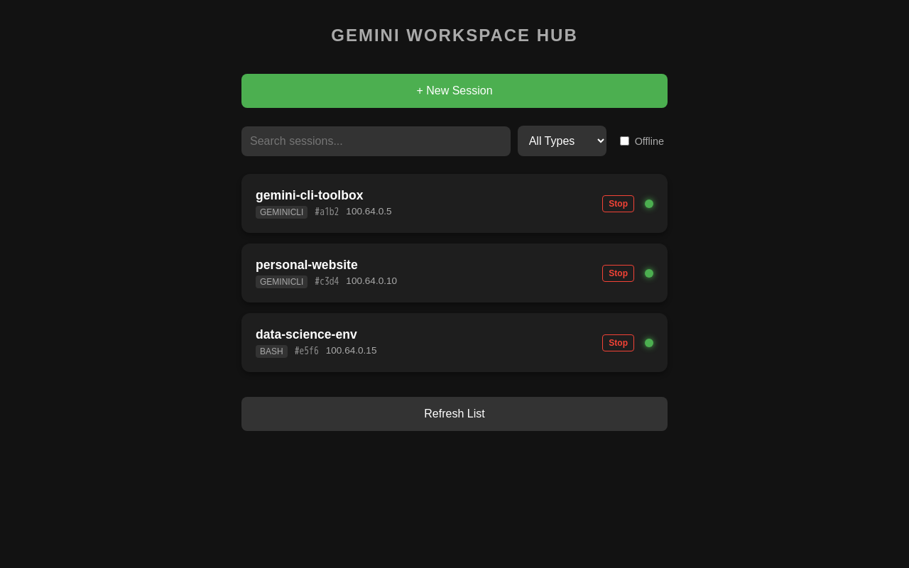
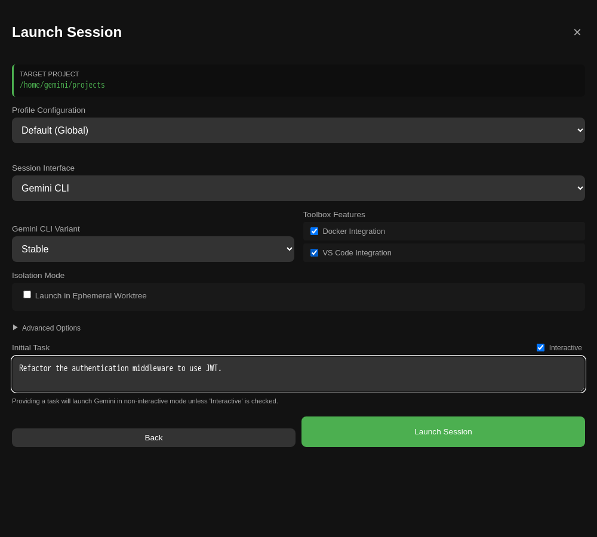
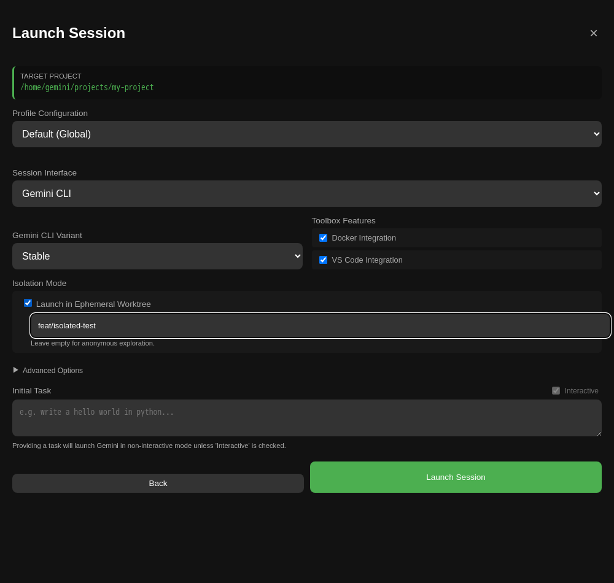

# 🤖 Gemini CLI Toolbox

[](https://github.com/Jsebayhi/gemini-cli-toolbox/actions)
[](https://github.com/Jsebayhi/gemini-cli-toolbox/actions)
[](https://hub.docker.com/r/jsebayhi/gemini-cli-toolbox)

**[GitHub](https://github.com/Jsebayhi/gemini-cli-toolbox) | [Docker Hub](https://hub.docker.com/r/jsebayhi/gemini-cli-toolbox)**

> **The zero-config, ultra-secure home for your Gemini AI agent.**
> Run the Gemini CLI in a Dockerized sandbox that keeps your host system clean while staying fully integrated with your tools (VS Code, Docker, VPN, git worktree).

---

## 🌟 Why Gemini Toolbox?

*   **🚀 Zero Config:** No Node.js, Python, or SDK setup required on your host. Just run the script.
*   **🛡️ Secure Sandbox:** The agent is trapped in the container. It cannot access files outside your project folder, guaranteeing no side effects on your OS.
*   **💻 VS Code Companion:** Native integration with your host IDE for context awareness and auto-diffs.
*   **🐳 Docker-Powered:** Extends the agent to any language. Build and test projects (Rust, PHP) using your host's Docker images, saving bandwidth and setup time.
*   **📱 Remote Access:** Code from your phone via Tailscale VPN.
*   **🌳 Ephemeral Worktrees:** Launch isolated worktrees of your repo for risk-free refactors or parallel tasks without touching your primary working directory.
*   **🔑 Multi-Profile:** Switch seamlessly between personal, work, and bot accounts using different config dirs.

---

## 📸 Visual Overview: The Gemini Hub

The Gemini Hub provides a centralized dashboard to discover, manage, and launch your sessions from any device (Desktop, Mobile, or Tablet) via Tailscale VPN.

### 🏠 Dashboard
Monitor all your active sessions at a glance. Identify projects, connection types (CLI/Bash), and status in real-time.


### 🚀 Zero-Config Launch Wizard
Start new sessions effortlessly by browsing your host's workspace roots. No need to remember complex CLI flags.


### 🌳 Isolated Worktrees
Toggle "Launch in Ephemeral Worktree" to experiment in a fully isolated branch without touching your primary codebase.


---

## ⚡ Quick Start (Under 5 Minutes)

### 1. Install the Wrapper
The `gemini-toolbox` script handles the complex Docker logic for you.

```bash
# Clone and enter the repo
git clone https://github.com/Jsebayhi/gemini-cli-toolbox.git
cd gemini-cli-toolbox

# Add to your PATH (Optional but recommended)
ln -s $(pwd)/bin/gemini-toolbox ~/.local/bin/gemini-toolbox
```

### 2. Enable Autocompletion (Optional)
```bash
source completions/gemini-toolbox.bash
source completions/gemini-hub.bash
```

### 3. Start Chatting
```bash
# Open interactive AI chat in the current folder
gemini-toolbox
```

---

## 🏗️ Core Concepts

The Toolbox isn't just a wrapper; it's a bridge between your host and a secure execution environment.

### 🛡️ 1. Security & Sandbox
*   **Isolation:** The agent runs inside a Debian container. It **cannot** see or modify files outside the project directory you mount.
*   **Protected Networking:** All sessions are private by default. They use bridge isolation and bind strictly to `127.0.0.1` on your host, making them invisible to your local network (LAN).
*   **Ephemeral:** Every session is clean. Use the container as a disposable playground.

### 💻 2. Developer Integration
*   **VS Code Companion:** Native support for the [Gemini CLI Companion](https://github.com/google/gemini-cli) extension. It reads your IDE context and applies diffs automatically.
*   **Docker-out-of-Docker (DooD):** The agent can run `docker` commands (build, run, compose) by talking to your host's daemon. It shares your local image cache for instant speed.
*   **Language Agnostic:** No need to install Node.js, Python, or Rust on your host. Build and test projects using the agent's internal environment or host Docker.

### 📱 3. Remote & Mobile Freedom
*   **Tailscale VPN:** Start a session with `--remote` to access it from your phone, tablet, or another PC via a secure mesh network.
*   **The Hub:** A built-in web dashboard (`http://gemini-hub:8888`) to discover and manage multiple active sessions from any device connected to the VPN.

### 🌳 4. Ephemeral Worktrees
*   **Zero-Risk Refactors:** Use `--worktree` to launch the agent in a dedicated, isolated worktree of your repository. Your main working directory remains untouched.
*   **Surgical Mounts:** The toolbox mounts your project Read-Only (`:ro`) to protect source code, while keeping the `.git` directory Read-Write (`:rw`) to allow the agent to commit and branch safely.
*   **Automatic Cleanup:** The Hub automatically prunes stale worktrees after 30 days (anonymous) or 90 days (named branches), keeping your cache clean.

📖 **[Read the full Architecture & Features Deep Dive](docs/ARCHITECTURE_AND_FEATURES.md)** for technical details on DooD, IDE mirroring, and VPN logic.

---

## 📚 Learning Path

Want to go deeper? Follow these guides to master the Toolbox:

1.  **[User Guide & Use Cases](docs/USER_GUIDE.md) (10 min):** Real-world examples and step-by-step guides for DevOps, Mobile, Security, and more.
2.  **[Architecture & Features](docs/ARCHITECTURE_AND_FEATURES.md) (20 min):** Deep dive into the internal mechanics (DooD, IDE protocols, networking).
3.  **[Architecture Decisions (ADRs)](adr/) (Reference):** Historical record of design choices.

---

## 📖 Key Features & Use Cases

### 🛠️ Common Commands
| Goal | Command |
| :--- | :--- |
| **Simple Chat** | `gemini-toolbox` |
| **Stop Session** | `gemini-toolbox stop [id\|project]` |
| **One-shot Task** | `gemini-toolbox -- -p "Fix the linting errors in src/"` |
| **Isolated Exploration** | `gemini-toolbox --worktree` |
| **Named Worktree** | `gemini-toolbox --worktree --name feat/auth` | 
| **Pure Localhost** | `gemini-toolbox --no-vpn` |
| **Beta Features** | `gemini-toolbox --preview` |
| **Remote Coding** | `gemini-toolbox --remote` |
| **Disposable Shell**| `gemini-toolbox --bash` |

### 📂 Multi-Account Management
Isolate your environments using configuration profiles.
```bash
# Use a specific profile (e.g., Work vs Personal)
gemini-toolbox --profile ~/.gemini-profiles/work
```

### 🌳 Isolated Exploration (Worktrees)
Launch a parallel session without stashing or committing your current work.
```bash
# Create an anonymous, isolated worktree for a quick experiment
gemini-toolbox --worktree -- -p "Try migrating to ESM"

# Or create a persistent, named branch for a feature
gemini-toolbox --worktree --name feat/api -- -p "Implement the new REST endpoints"
```
The agent works in an isolated environment. If the experiment fails, simply exit—the Hub will clean it up later.

### 🕒 Recent Paths
The Hub wizard automatically remembers your last 3 paths (stored in your browser's `localStorage`), making it effortless to jump back into a project from mobile.

---

## 🔧 Advanced Configuration

### Persistent Settings (`extra-args`)
Inside a profile directory (when using `--profile`), create a file named `extra-args` to store flags you use every time. It supports blank lines and comments using `#`:
```text
# ~/.gemini-profiles/work/extra-args
--volume "/mnt/data/docs:/docs" # Mount my documentation
--no-ide # Disable VS Code integration for this profile

--preview # Always use the latest beta features
```

### 📦 Speeding up builds (Caching)
Since sessions are fully sandboxed by default, language caches (Maven, Gradle, etc.) are ephemeral. To reuse your host's caches for faster builds, add them to your profile's `extra-args`:
```text
# ~/.gemini-profiles/work/extra-args
--volume "/home/user/.m2:/home/gemini/.m2"
--volume "/home/user/.gradle:/home/gemini/.gradle"
--volume "/home/user/.npm:/home/gemini/.npm"
```

### 📜 Persistent Bash History
Keep your command history across container restarts:
```bash
gemini-toolbox -v ~/.gemini_bash_history:/home/gemini/.bash_history --bash
```

### 📂 Customizing Worktree Cache
By default, worktrees are stored in `~/.cache/gemini-toolbox/worktrees`. Override this with:
```bash
export GEMINI_WORKTREE_ROOT="/mnt/fast-ssd/worktrees"
gemini-toolbox --worktree
```

---

## 🤝 Contributing
We love contributors! If you add or modify CLI flags, please remember to update the scripts in `completions/`. See [CONTRIBUTING.md](docs/CONTRIBUTING.md) for more details.

## 🛠️ Development

If you're contributing to the Toolbox, you can run the full suite of automated tests and linters:

```bash
# Run all tests (Bash & Hub), linters, and security scans
make local-ci

# Build specific image groups
make build-toolbox # Hub, CLI, CLI-Preview
make build-clis    # CLI Stable and Preview only

# Run security vulnerability scan (Trivy)
make scan

# Run specific automated test suites
make test-bash     # Bash core scripts (Bats)
make test-hub      # Gemini Hub unit/integration (Pytest)
make test-hub-ui   # Gemini Hub UI (Playwright)
```

We use [Bats-core](https://github.com/bats-core/bats-core) for testing our core bash scripts. New tests should be added to `tests/bash/`.

## 📄 License
MIT
